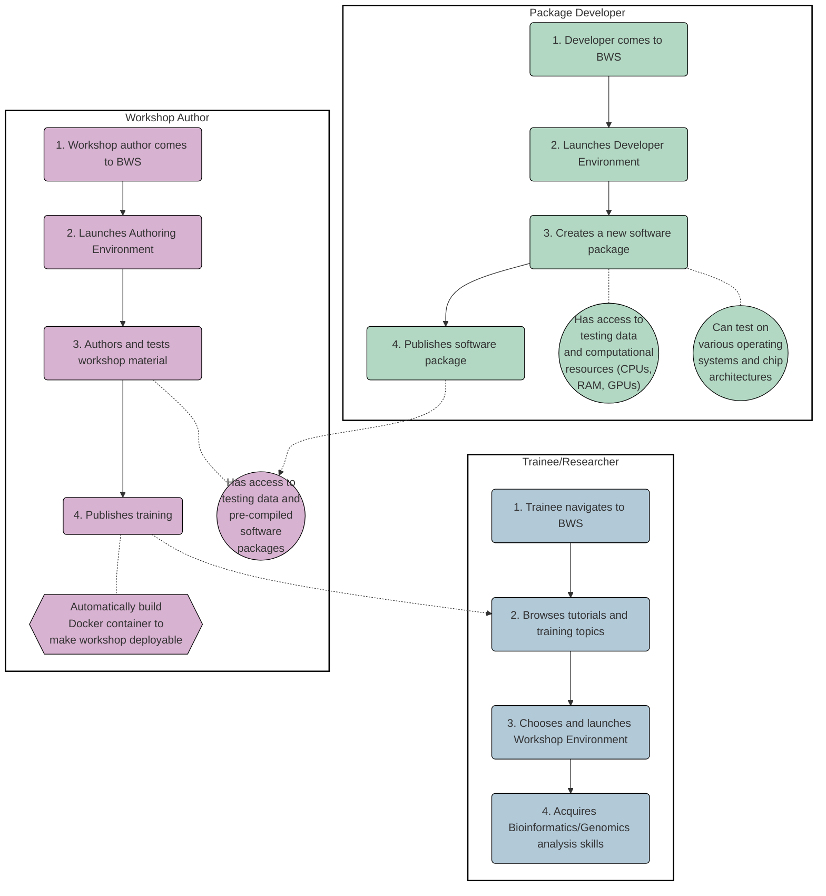

```mermaid
graph TB
  classDef traineecolor fill:#b2c9d8,stroke:#000;
  classDef authorcolor fill:#d8b2d1,stroke:#000;
  classDef developercolor fill:#b2d8c3,stroke:#000;
  style traineebox fill:#fff,stroke:#000,stroke-width:2px
  style authorbox fill:#fff,stroke:#000,stroke-width:2px
  style developerbox fill:#fff,stroke:#000,stroke-width:2px
  subgraph traineebox[Trainee/Researcher]
    A1(1. Trainee navigates to BWS)-->A2(2. Browses tutorials and training topics)
    A2-->A3(3. Chooses and launches Workshop Environment)
    A3-->A4(4. Acquires Bioinformatics/Genomics analysis skills)
    class A1,A2,A3,A4 traineecolor
  end
  subgraph authorbox[Workshop Author]
    B1(1. Workshop author comes to BWS)-->B2(2. Launches Authoring Environment)
    B2-->B3(3. Authors and tests workshop material)
    B3-->B4(4. Publishes training)
    B3-.-B91((Has access to<br/>testing data and<br/>pre-compiled<br/>software<br/>packages))
    B4-.-B92{{Automatically build<br/>Docker container to<br/>make workshop deployable}}
    class B1,B2,B3,B4,B91,B92 authorcolor
  end
  subgraph developerbox[Package Developer]
    C1(1. Developer comes to BWS)-->C2(2. Launches Developer Environment)
    C2-->C3(3. Creates a new software package)
    C3-->C4(4. Publishes software package)
    C3-.-C91(("Has access to<br/>testing data<br/>and computational<br/>resources (CPUs,<br/>RAM, GPUs)"))
    C3-.-C92((Can test on<br/>various operating<br/>systems and chip<br/>architectures))
    class C1,C2,C3,C4,C91,C92 developercolor
  end
  B4-.->A2
  C4-.->B91
```

